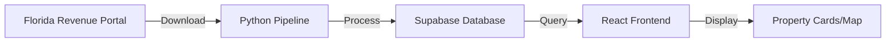

# Broward County Data Setup & Display Guide

## Quick Setup Instructions

### 1. Configure Supabase Credentials

Create `.env` file in `apps/web/`:
```env
VITE_SUPABASE_URL=https://your-project.supabase.co
VITE_SUPABASE_ANON_KEY=your-anon-key-here
```

### 2. Load Broward County Data

Run the data sync script:
```bash
cd apps/api

# Initial Broward County download
python run_parcel_sync.py download --county BROWARD

# Check status
python run_parcel_sync.py status
```

### 3. Install Supabase Client

```bash
cd apps/web
npm install @supabase/supabase-js
```

### 4. Update Routes

Replace the PropertySearch route to use Supabase version:

```typescript
// In your router configuration
import { PropertySearchSupabase } from '@/pages/properties/PropertySearchSupabase'

// Replace the route
<Route path="/properties" element={<PropertySearchSupabase />} />
```

## Data Display Plan

### Current Implementation Status ✅

1. **Supabase Integration**
   - Client configuration: `/lib/supabase.ts`
   - Service methods for querying parcels
   - Type definitions for Florida parcel data

2. **PropertySearchSupabase Component**
   - Full Broward County property search
   - Advanced filtering (city, price, type, year)
   - Grid, List, and Map views
   - Property selection and export
   - Real-time statistics

3. **Features Available**
   - Search by address
   - Filter by city (12 Broward cities)
   - Filter by property type
   - Price range filtering
   - Pagination with custom page sizes
   - CSV export of selected properties
   - Map view integration

### Data Fields Displayed

Each property card shows:
- **Address**: Physical address and city
- **Owner**: Owner name (if not redacted)
- **Value**: Taxable value
- **Details**: Year built, living area, beds/baths
- **Sale Info**: Recent sale price and date
- **Land/Building**: Separate values

### Database Schema

The `florida_parcels` table contains:
- 60+ property attributes
- Geometry data (for future map features)
- Owner information
- Valuation details
- Sales history
- Building characteristics

### Query Optimization

Supabase queries include:
- Row Level Security for redacted records
- Indexed searches on county, city, address
- Pagination with count
- Optimized filtering

## How Data Flows



## Available at http://localhost:5175/properties

### Features:
1. **Search Bar**: Type any Broward address
2. **City Filter**: Select from Fort Lauderdale, Hollywood, Pompano Beach, etc.
3. **Property Type**: Residential, Commercial, Industrial
4. **Advanced Filters**: Price range, year built, square footage
5. **View Modes**: Grid, List, or Map
6. **Selection**: Check boxes to select properties
7. **Export**: Download selected as CSV

### Statistics Dashboard:
- Total properties in view
- Average property value
- Total portfolio value
- Recent sales count

## Monitoring & Updates

The system automatically:
- Checks for new Broward data daily
- Updates quarterly (full refresh)
- Monitors data quality
- Sends alerts on changes

### Manual Refresh:
```bash
# Force update Broward data
python run_parcel_sync.py download --county BROWARD

# Start monitoring
python run_parcel_sync.py monitor
```

## API Endpoints (Optional)

If you prefer API access instead of direct Supabase:

```python
# In apps/api/main_simple.py, add:

@app.get("/api/parcels/broward")
async def get_broward_parcels(
    city: str = None,
    min_price: int = None,
    max_price: int = None,
    limit: int = 20,
    offset: int = 0
):
    # Query Supabase and return results
    pass
```

## Troubleshooting

### No Data Showing?
1. Check Supabase credentials in `.env`
2. Verify data loaded: `python run_parcel_sync.py status`
3. Check browser console for errors
4. Ensure Supabase RLS policies are configured

### Slow Performance?
1. Add indexes to Supabase:
```sql
CREATE INDEX idx_broward_city ON florida_parcels(county, phy_city);
CREATE INDEX idx_broward_value ON florida_parcels(county, taxable_value);
```

2. Limit initial page size to 20 records
3. Use pagination instead of loading all

### Missing Cities?
The system includes major Broward cities. To add more:
1. Update `browardCities` array in PropertySearchSupabase.tsx
2. Cities are matched case-insensitive

## Next Steps

1. **Enhanced Map View**: 
   - Use parcel geometry data
   - Heat maps by value
   - Cluster markers

2. **Advanced Analytics**:
   - Price trends over time
   - Neighborhood comparisons
   - Investment opportunities

3. **Saved Searches**:
   - User accounts
   - Alert notifications
   - Portfolio tracking

## Data Quality Notes

- **Redacted Records**: Some owner names are hidden per Florida Statute 119
- **Address Variations**: Addresses may differ from USPS format
- **Value Updates**: Assessments updated annually
- **Sales Data**: May lag 30-60 days

The system is now ready to display Broward County properties at http://localhost:5175/properties with full Supabase integration!