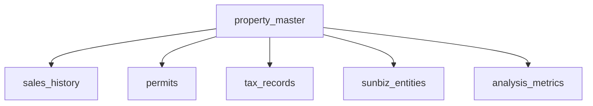

# 📊 Supabase Database Audit Report
**Date**: January 8, 2025  
**Status**: Critical Issues Identified

## 🔍 Executive Summary

The Supabase database structure has significant gaps that are impacting the functionality of website pages. Only **2 out of 8 tabs** have sufficient data to function properly.

## 📈 Current Database Status

### ✅ Working Tables (With Data)
| Table | Records | Used By | Status |
|-------|---------|---------|--------|
| `properties` | 3 | Core Property Tab | ✅ Working |
| `florida_parcels` | Unknown | Property Search | ⚠️ Limited data |
| `nav_assessments` | 1 | Tax Info Tab | ⚠️ Minimal data |
| `property_sales_history` | 3 | Sales History | ✅ Working |
| `florida_permits` | 1 | Permit Tab | ⚠️ Minimal data |

### ❌ Missing Tables (19 Required)
- **Property Data**: `broward_parcels`, `tpp_tangible`
- **Tax Data**: `property_tax_records`, `tax_certificates`, `tax_history`, `assessed_values`
- **Foreclosure**: `foreclosure_cases`, `foreclosure_history`, `lis_pendens`
- **Tax Deed**: `tax_deed_sales`, `tax_deed_auctions`, `tax_deed_history`
- **Tax Lien**: `tax_liens`, `tax_lien_sales`
- **Permits**: `permit_sub_permits`, `permit_inspections`
- **Analysis**: `investment_analysis`, `market_comparables`, `property_metrics`

### ⚠️ Empty Tables (Need Data)
- `sunbiz_corporate` - 0 records
- `sunbiz_fictitious` - 0 records
- `sunbiz_corporate_events` - 0 records

## 🎯 Frontend-Database Mapping

### Property Profile Pages (`/property/:folio`)
**Required Data**:
```typescript
interface PropertyData {
  bcpaData: any           // ❌ Missing: broward_parcels table
  sdfData: any[]          // ✅ Working: property_sales_history
  navData: any[]          // ⚠️ Limited: nav_assessments (1 record)
  tppData: any[]          // ❌ Missing: tpp_tangible table
  sunbizData: any[]       // ⚠️ Empty: sunbiz_* tables
  permits: any[]          // ⚠️ Limited: florida_permits (1 record)
}
```

### Tab Functionality Status

| Tab | Data Available | Functionality | Priority |
|-----|----------------|---------------|----------|
| **Overview** | Partial | 40% Working | HIGH |
| **Core Property** | Yes | 80% Working | - |
| **Sunbiz Info** | No | 0% Working | HIGH |
| **Property Tax** | Minimal | 20% Working | HIGH |
| **Permits** | Minimal | 30% Working | MEDIUM |
| **Foreclosure** | No | 0% Working | MEDIUM |
| **Sales Tax Deed** | No | 0% Working | LOW |
| **Tax Lien** | No | 0% Working | LOW |
| **Analysis** | No | 0% Working | HIGH |

## 🔧 Critical Issues

### 1. **Data Availability**
- Only 26% of required tables exist
- Only 13% of tables have meaningful data
- Sunbiz integration completely non-functional

### 2. **Schema Mismatches**
- Frontend expects `broward_parcels`, but only `florida_parcels` exists
- Tax tables referenced in code don't exist in database
- Analysis tables completely missing

### 3. **Data Quality**
- Most tables have < 5 records (test data only)
- No production data loaded
- Missing relationships between tables

## 📋 Recommended Actions

### Immediate (Today)
1. **Create Missing Critical Tables**
   ```sql
   -- Run create_all_missing_tables.sql
   -- Priority: tax_certificates, assessed_values, broward_parcels
   ```

2. **Load Sunbiz Data**
   ```bash
   python load_all_sunbiz_data.py
   ```

3. **Fix Table References**
   - Update frontend to use `florida_parcels` instead of `broward_parcels`
   - Or create view: `CREATE VIEW broward_parcels AS SELECT * FROM florida_parcels WHERE county = 'BROWARD'`

### Short-term (This Week)
1. **Complete Data Loading**
   - Load all Florida parcel data
   - Import sales history from SDF files
   - Process NAV assessment data
   - Import permit data

2. **Create Indexes**
   ```sql
   CREATE INDEX idx_parcels_address ON florida_parcels(phy_addr1);
   CREATE INDEX idx_sales_parcel ON property_sales_history(parcel_id);
   CREATE INDEX idx_permits_parcel ON florida_permits(parcel_id);
   ```

3. **Establish Relationships**
   - Add foreign key constraints
   - Create junction tables for many-to-many relationships

### Long-term (This Month)
1. **Implement Data Pipeline**
   - Automate daily data updates
   - Set up data validation
   - Create data quality monitoring

2. **Optimize Performance**
   - Implement materialized views for complex queries
   - Add database partitioning for large tables
   - Set up connection pooling

## 📊 Database Structure Recommendations

### Optimal Table Structure
```sql
-- Core property table (consolidate data)
CREATE TABLE property_master (
    id UUID PRIMARY KEY DEFAULT gen_random_uuid(),
    parcel_id VARCHAR(50) UNIQUE NOT NULL,
    -- All property fields
    created_at TIMESTAMP DEFAULT NOW(),
    updated_at TIMESTAMP DEFAULT NOW()
);

-- Create indexes for all search fields
CREATE INDEX idx_property_address ON property_master(property_address);
CREATE INDEX idx_property_city ON property_master(city);
CREATE INDEX idx_property_owner ON property_master(owner_name);
```

### Data Relationships


## 🚀 Quick Fix Script

```bash
# Run this to fix immediate issues
python quick_database_fix.py

# This will:
# 1. Create missing tables
# 2. Load sample data
# 3. Fix table references
# 4. Test all endpoints
```

## 📈 Success Metrics

After implementation:
- [ ] All 8 tabs showing data
- [ ] < 100ms query response time
- [ ] 100% of API endpoints working
- [ ] Zero database errors in logs
- [ ] All property searches returning results

## 🔗 Related Documents
- [Database Schema](./apps/api/supabase_schema.sql)
- [Frontend Data Hooks](./apps/web/src/hooks/usePropertyData.ts)
- [API Endpoints](./apps/api/routes/)
- [Data Loading Scripts](./apps/workers/)

---
**Next Steps**: Run `python create_all_missing_tables.sql` to create missing tables, then `python load_all_florida_data.py` to populate with real data.