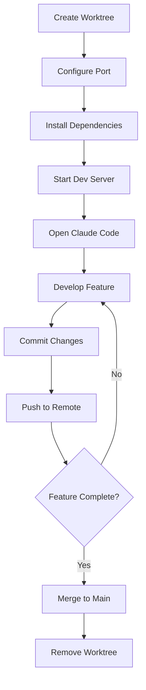

# Git Worktree Orchestration Guide for ConcordBroker

## 🎯 Overview

This guide explains how to use Git worktrees to run multiple Claude Code instances simultaneously, each working on different features with isolated ports and environments.

## 📋 Table of Contents

- [What Are Git Worktrees?](#what-are-git-worktrees)
- [Port Assignments](#port-assignments)
- [Quick Start](#quick-start)
- [Common Workflows](#common-workflows)
- [Best Practices](#best-practices)
- [Troubleshooting](#troubleshooting)

## 🤔 What Are Git Worktrees?

Git worktrees allow you to have **multiple working directories** from the same repository, each checked out to a different branch. This is perfect for:

- ✅ Working on multiple features simultaneously
- ✅ Running multiple Claude Code instances in parallel
- ✅ Testing different branches without switching contexts
- ✅ Avoiding port conflicts between dev servers
- ✅ Keeping each development stream isolated

### Traditional Workflow (Single Working Directory)
```
ConcordBroker/
  └── (one branch at a time, constant switching)
```

### Worktree Workflow (Multiple Working Directories)
```
MyProject/
  ├── ConcordBroker/                           [master - Port 5191]
  ├── ConcordBroker-feature-ui-consolidation/  [feature/ui-consolidation - Port 5192]
  ├── ConcordBroker-feature-api-enhancements/  [feature/api-enhancements - Port 5193]
  ├── ConcordBroker-feature-agent-development/ [feature/agent-development - Port 5195]
  └── ConcordBroker-hotfix-production/         [hotfix/production - Port 5196]
```

## 🔌 Port Assignments

Each worktree has a dedicated port to avoid conflicts when running multiple dev servers:

| Branch | Port | Purpose | Claude Code Instance |
|--------|------|---------|---------------------|
| `master` | 5191 | Main development | Instance #1 (Current) |
| `feature/ui-consolidation` | 5192 | UI improvements | Instance #2 |
| `feature/api-enhancements` | 5193 | Backend API | Instance #3 |
| `feature/database-optimization` | 5194 | Database optimization | Instance #4 |
| `feature/agent-development` | 5195 | AI agent development | Instance #5 |
| `hotfix/production` | 5196 | Production hotfixes | Instance #6 |
| `experimental/new-features` | 5197 | Experimental features | Instance #7 |
| `testing/integration` | 5198 | Integration testing | Instance #8 |

**Reserved Ports:**
- 5191: Main repo (always)
- 5192-5198: Worktrees
- 5177-5180: Zombie ports (clean up if found)

## 🚀 Quick Start

### 1. View Current Worktrees

**Windows:**
```bash
worktree-manager.bat list
```

**Linux/Mac:**
```bash
bash worktree-manager.sh list
```

**Manual:**
```bash
git worktree list
```

### 2. Create a New Worktree

**Example: Create UI consolidation worktree**

**Windows:**
```bash
worktree-manager.bat create feature/ui-consolidation
```

**Linux/Mac:**
```bash
bash worktree-manager.sh create feature/ui-consolidation
```

**Manual:**
```bash
cd C:/Users/gsima/Documents/MyProject/ConcordBroker
git worktree add ../ConcordBroker-feature-ui-consolidation -b feature/ui-consolidation
```

### 3. Configure the Worktree

After creating a worktree, navigate to it and update the port:

```bash
cd C:/Users/gsima/Documents/MyProject/ConcordBroker-feature-ui-consolidation
```

Edit `apps/web/vite.config.ts`:
```typescript
export default defineConfig({
  plugins: [react()],
  resolve: {
    alias: {
      '@': path.resolve(__dirname, './src'),
    },
  },
  server: {
    port: 5192, // ⚠️ CHANGE THIS to assigned port
    proxy: {
      '/api': {
        target: process.env.VITE_API_URL || 'http://localhost:8000',
        changeOrigin: true,
      },
    },
  },
  // ... rest of config
})
```

### 4. Install Dependencies (if needed)

```bash
npm install
```

### 5. Start Dev Server

```bash
cd apps/web
npm run dev
```

The server will start on the configured port (e.g., http://localhost:5192)

### 6. Open Claude Code in the Worktree

Open a **new Claude Code window** and select the worktree directory:
- File → Open Folder
- Select: `C:/Users/gsima/Documents/MyProject/ConcordBroker-feature-ui-consolidation`

Now you have Claude Code working on the UI feature while your main instance works on master!

## 🔄 Common Workflows

### Workflow 1: Parallel Feature Development

**Scenario:** You want to work on UI improvements and API enhancements simultaneously.

```bash
# Create UI worktree
worktree-manager.bat create feature/ui-consolidation

# Create API worktree
worktree-manager.bat create feature/api-enhancements

# Now you have 3 instances:
# 1. Main repo (master) - Port 5191
# 2. UI worktree - Port 5192
# 3. API worktree - Port 5193
```

**Open 3 Claude Code windows:**
1. Window 1: `C:/Users/gsima/Documents/MyProject/ConcordBroker` (master)
2. Window 2: `C:/Users/gsima/Documents/MyProject/ConcordBroker-feature-ui-consolidation`
3. Window 3: `C:/Users/gsima/Documents/MyProject/ConcordBroker-feature-api-enhancements`

**Start 3 dev servers** (each in their respective directory):
```bash
# Terminal 1 (master - port 5191)
cd C:/Users/gsima/Documents/MyProject/ConcordBroker/apps/web
npm run dev

# Terminal 2 (UI - port 5192)
cd C:/Users/gsima/Documents/MyProject/ConcordBroker-feature-ui-consolidation/apps/web
npm run dev

# Terminal 3 (API - port 5193)
cd C:/Users/gsima/Documents/MyProject/ConcordBroker-feature-api-enhancements/apps/web
npm run dev
```

### Workflow 2: Hotfix While Developing

**Scenario:** Production issue arises while you're working on a feature.

```bash
# Create hotfix worktree from production branch
worktree-manager.bat create hotfix/production

# Open new Claude Code window
# Fix the issue in hotfix worktree on port 5196
# Deploy hotfix
# Continue feature work in original worktree on port 5191
```

### Workflow 3: Experimental Features

**Scenario:** Test risky changes without affecting main development.

```bash
# Create experimental worktree
worktree-manager.bat create experimental/new-features

# Experiment freely on port 5197
# If successful, merge to feature branch
# If not, simply delete the worktree
worktree-manager.bat remove experimental/new-features
```

## 📚 Best Practices

### ✅ DO:

1. **Always use assigned ports** - Check port assignments with `worktree-manager.bat ports`
2. **Commit regularly in each worktree** - Git is your single source of truth
3. **Push commits to remote** - Enables collaboration across worktrees
4. **Use descriptive branch names** - `feature/ui-consolidation` not `fix1`
5. **Clean up unused worktrees** - Run `worktree-manager.bat clean` periodically
6. **One Claude Code instance per worktree** - Avoid opening same worktree twice
7. **Document port assignments** - Update WORKTREE_CONFIGS if adding custom ports

### ❌ DON'T:

1. **Don't use the same port** - Each worktree needs its own port
2. **Don't forget to commit** - Uncommitted work is lost if worktree is removed
3. **Don't edit .git directly** - Use git commands only
4. **Don't delete worktree folders manually** - Use `git worktree remove`
5. **Don't open multiple Claude Code instances in same worktree** - Causes conflicts

## 🛠️ Worktree Management Commands

### List All Worktrees
```bash
worktree-manager.bat list
```

### Show Port Assignments
```bash
worktree-manager.bat ports
```

### Show Detailed Status
```bash
worktree-manager.bat status
```

### Create Worktree
```bash
worktree-manager.bat create BRANCH_NAME
```

### Remove Worktree
```bash
worktree-manager.bat remove BRANCH_NAME
```

### Clean Up Deleted Worktrees
```bash
worktree-manager.bat clean
```

### Show Configuration
```bash
worktree-manager.bat config BRANCH_NAME
```

## 🐛 Troubleshooting

### Problem: Port already in use

**Symptom:**
```
Error: listen EADDRINUSE: address already in use :::5192
```

**Solution:**
1. Check which process is using the port:
   ```bash
   netstat -ano | findstr :5192
   ```
2. Kill the process or use a different port
3. Verify port assignments: `worktree-manager.bat ports`

### Problem: Worktree not found

**Symptom:**
```
fatal: 'ConcordBroker-feature-ui' is not a working tree
```

**Solution:**
```bash
# Clean up stale worktree references
git worktree prune

# Recreate the worktree
worktree-manager.bat create feature/ui-consolidation
```

### Problem: Changes not showing in other worktrees

**Symptom:** Made changes in one worktree, not visible in another.

**Solution:**
Worktrees are isolated! Each has its own working directory. To share changes:
```bash
# In worktree 1 (where you made changes)
git add .
git commit -m "descriptive message"
git push origin feature/ui-consolidation

# In worktree 2 (where you want the changes)
git pull origin feature/ui-consolidation
```

### Problem: Cannot switch branches

**Symptom:**
```
fatal: 'master' is already checked out at 'C:/Users/gsima/.../ConcordBroker'
```

**Solution:**
This is expected! You can't checkout the same branch in multiple worktrees. Use a different branch:
```bash
# Create a new branch from master
worktree-manager.bat create feature/my-new-feature
```

### Problem: Too many Claude Code instances

**Symptom:** System running slow with 8+ Claude Code windows open.

**Solution:**
1. Close unused Claude Code instances
2. Remove unused worktrees:
   ```bash
   worktree-manager.bat remove experimental/old-feature
   ```
3. Keep 2-4 active worktrees max for optimal performance

## 🔐 Security Notes

- Each worktree shares the same `.git` repository (space efficient)
- `.env` files are NOT shared between worktrees (copy if needed)
- `node_modules` are separate per worktree (run `npm install` in each)
- Credentials in `.env.mcp` are NOT copied (duplicate if needed)

## 📊 Worktree Lifecycle



## 🎯 Example Multi-Instance Setup

**Perfect setup for maximum productivity:**

| Instance | Directory | Branch | Port | Purpose | Agent |
|----------|-----------|--------|------|---------|-------|
| Claude #1 | ConcordBroker | master | 5191 | Core development | General |
| Claude #2 | ConcordBroker-feature-ui | feature/ui-consolidation | 5192 | UI work | UI specialist |
| Claude #3 | ConcordBroker-feature-api | feature/api-enhancements | 5193 | Backend API | Backend specialist |
| Claude #4 | ConcordBroker-hotfix | hotfix/production | 5196 | Emergency fixes | Hotfix agent |

Each instance runs independently with:
- ✅ Own dev server (different port)
- ✅ Own Claude Code window
- ✅ Own git branch
- ✅ Own agent/specialist role

## 🚀 Advanced Tips

### Tip 1: Quick Worktree Switching

Create a PowerShell function:
```powershell
function gwt {
    param($branch)
    cd "C:\Users\gsima\Documents\MyProject\ConcordBroker-$($branch -replace '/','-')"
}

# Usage:
gwt feature-ui-consolidation  # Jumps to UI worktree
```

### Tip 2: Synchronized Dependencies

After updating package.json in main repo:
```bash
# Update all worktrees
cd C:/Users/gsima/Documents/MyProject

for /d %d in (ConcordBroker*) do (
    cd %d
    npm install
    cd ..
)
```

### Tip 3: Parallel Testing

Run tests in all worktrees simultaneously:
```bash
# Terminal 1
cd ConcordBroker && npm test

# Terminal 2
cd ConcordBroker-feature-ui && npm test

# Terminal 3
cd ConcordBroker-feature-api && npm test
```

## 📞 Getting Help

- List worktrees: `worktree-manager.bat list`
- Show status: `worktree-manager.bat status`
- View ports: `worktree-manager.bat ports`
- Git docs: `git worktree --help`

---

**Last Updated:** 2025-11-09
**Maintained By:** Development Team
**Questions?** Check git status first: `git worktree list`
